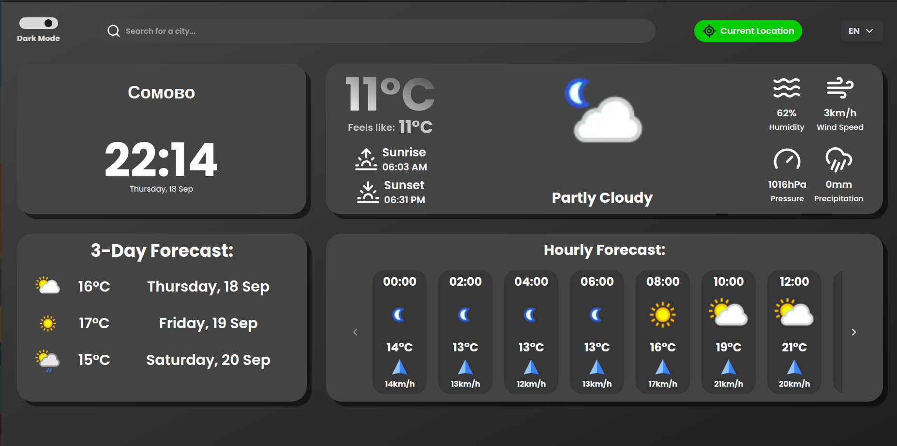
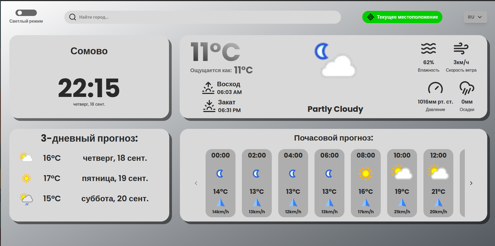
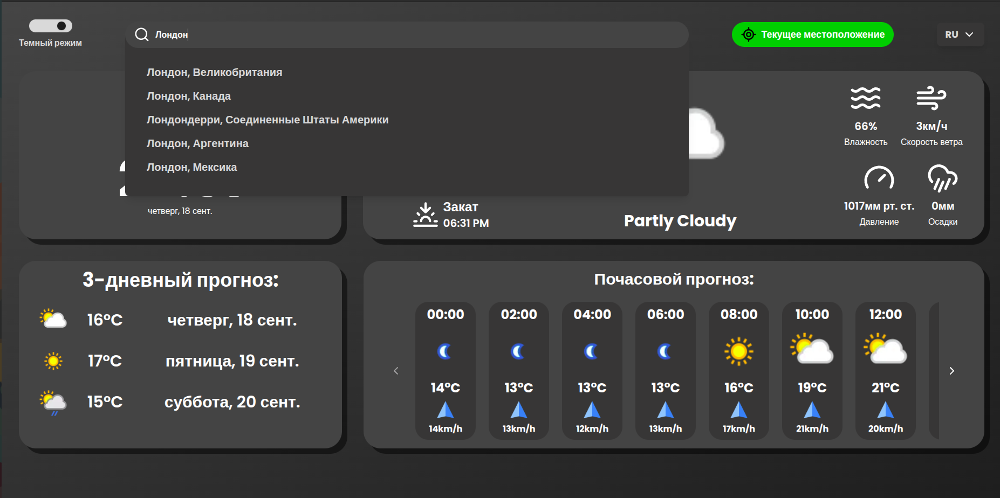

# 🌦️ Weather React

Интерактивное приложение прогноза погоды, созданное на **React + TypeScript** с использованием **Redux Toolkit**, **Redux Query** и **Geolocation API**. Архитектура построена на принципах **Feature-Sliced Design (FSD)** для масштабируемости и удобства поддержки.

## ✨ Возможности

- Работа с API от weatherapi.com
- Определение текущего местоположения через **Geolocation API**  
- Получение прогноза погоды с внешнего API  
- Отображение текущей температуры, влажности, скорости ветра и других параметров  
- Поддержка нескольких городов (поиск)  
- Чистая модульная архитектура по принципам **FSD**
- Поддержка выбора языка (i18n)  
- Тёмная / светлая тема  

## 🛠️ Стек технологий

- **React 18** + **TypeScript**  
- **Redux Toolkit (RTK)**  
- **Redux Query** для работы с API  
- **Geolocation API** (определение позиции пользователя)  
- **Feature-Sliced Design** (структурирование проекта)  

## 📂 Архитектура (FSD)

src/
 ├── app/          # Инициализация приложения
 ├── pages/        # Страницы
 ├── features/     # Фичи (CitySearch, LocationDetector и др.)
 ├── entities/     # Сущности (City, Weather)
 ├── shared/       # Переиспользуемые компоненты, utils, libs
 ├── widgetes/     # Виджеты (крупные UI-блоки, собирающие данные из features/entities и отображающие их)

## 🚀 Установка и запуск

### .env
```env
VITE_WEATHER_API_KEY=API_KEY
VITE_WEATHER_API_URL=http://api.weatherapi.com/v1
```

### Запуск
```bash
# Клонируем репозиторий
git clone https://github.com/Idzey/weather-react.git
cd weather-react

# Устанавливаем зависимости
npm install

# Запускаем в режиме разработки
npm run dev

# Сборка продакшн-версии
npm run build
```

## 🔮 Планы по развитию

- [ ] История поиска городов  
- [ ] Unit и e2e тесты  

## 📸 Скриншоты

### Главный экран



### Поиск города

